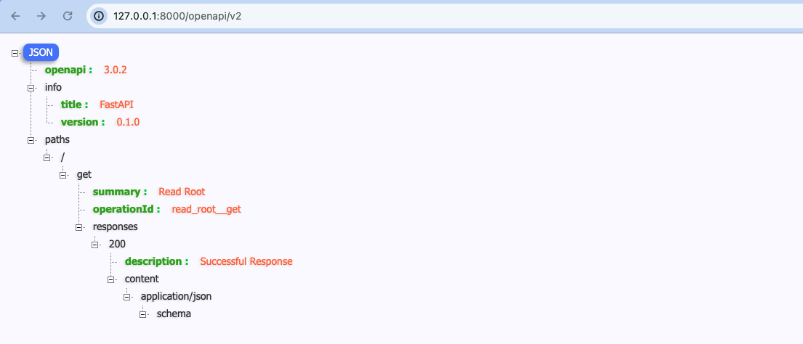

# openapi-example

#### 1 Quick Start

```shell
docker run --rm -p 8000:8000 ${REPO}/openapi-example:latest

# or

make run
```

#### 2 Check it
Now go to http://127.0.0.1:8000/openapi/v2.




#### 3 Update dependencies

```shell
make update-dependencies
```